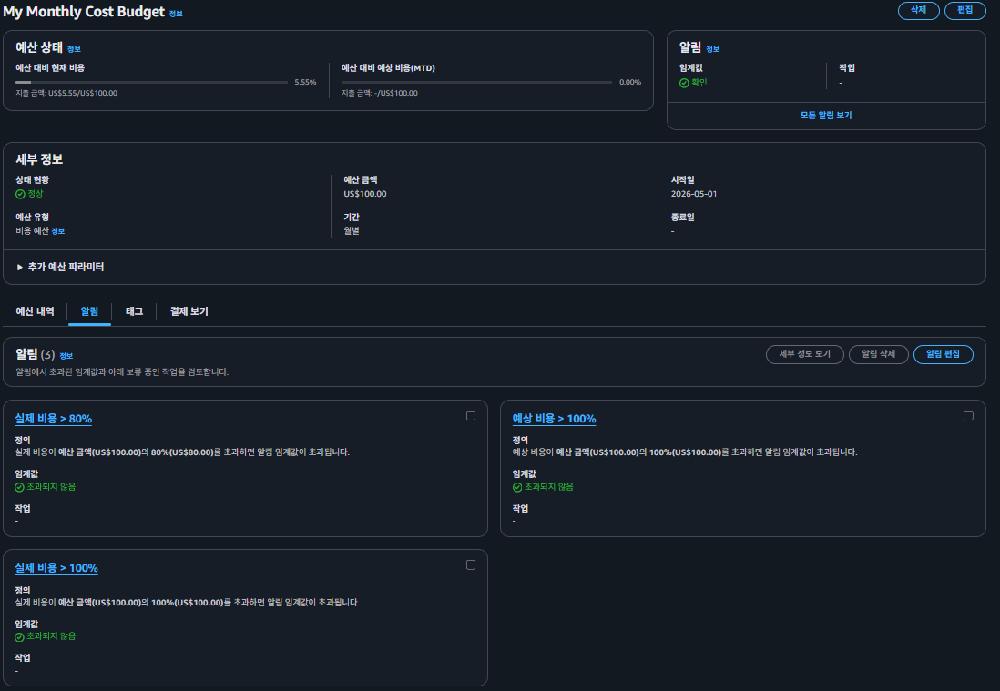
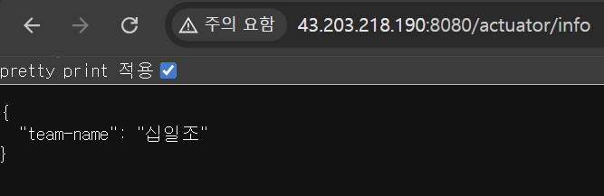
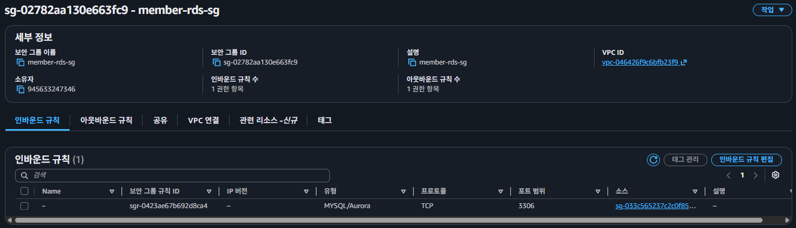
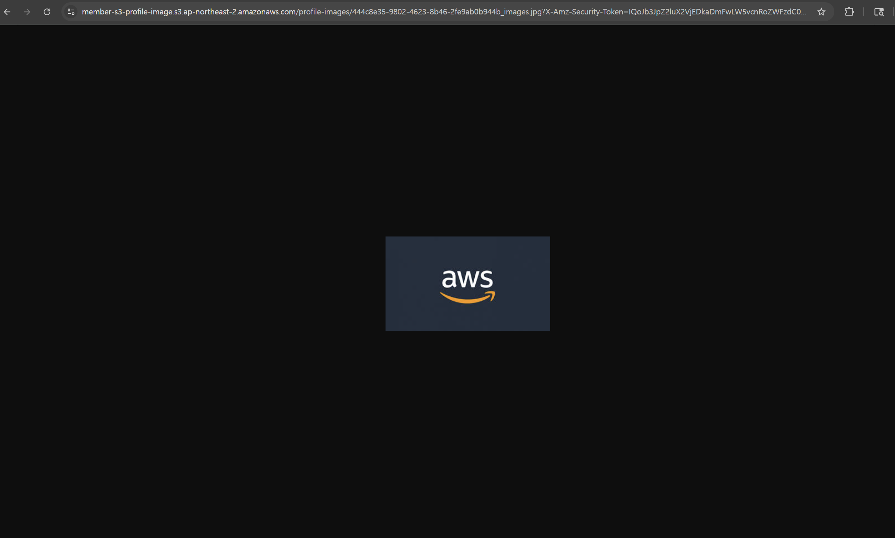
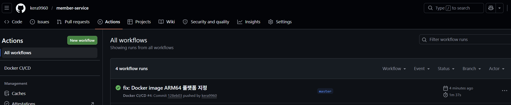
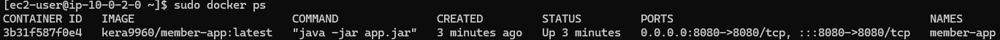

## Lv 0 - AWS Budgets 설정

### AWS Budgets 설정 화면

---

## Lv 1 - 네트워크 구축 및 핵심 기능 배포

### EC2 배포 정보

- EC2 Public IP: 3.36.118.37
- Health Check URL: http://3.36.118.37:8080/actuator/health

---

## Lv 2 - DB 분리 및 보안 연결

### Actuator info 엔드포인트

- info URL: http://43.203.218.190:8080/actuator/info

### RDS 보안 그룹

---

## Lv 3 - 프로필 사진 기능 추가와 권한 관리

### 프로필 이미지 Presigned URL 테스트

- Presigned URL 유효기간: 7일
- 만료 시간: 2026-05-28T18:10:00

---

## Lv 4 - Docker & CI/CD 파이프라인 구축

### Github Actions 실행 결과

### EC2 Docker 실행 결과

---
